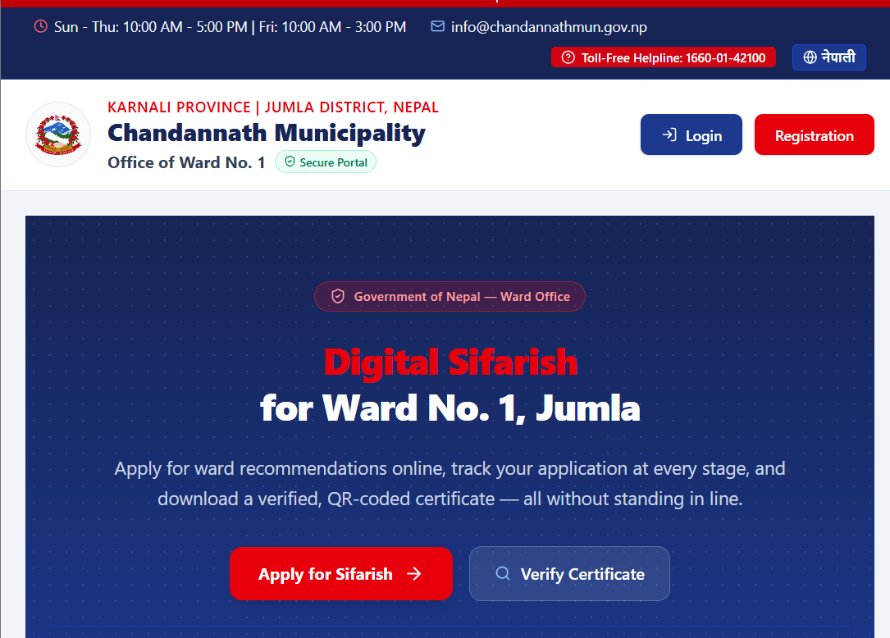

# E-ward Sifarish System

A digital platform that lets citizens submit recommendation/certificate applications ("sifarish") to their local ward office online, and routes each application through a structured, multi-stage approval workflow — replacing the traditional in-person, paper-based process.

## Problem It Solves

Getting a recommendation letter or certificate from a ward office traditionally requires citizens to visit in person, submit physical documents, and follow up manually across multiple desks. This system digitizes that entire journey — from submission to final certificate issuance — with full status tracking at every stage.

## Workflow

```
Citizen submits application
        ↓
Front Office verifies documents & payment
        ↓
Secretary reviews and recommends
        ↓
Chairperson gives final approval
        ↓
Certificate generated (QR-verifiable)
```

Each stage can either move the application forward or reject it (with a reason), and the citizen is notified at every step.

## Roles & Permissions

| Role | Responsibility | Actions |
|---|---|---|
| **Citizen** | Submits applications with personal details and required documents; tracks status | Submit, view own applications |
| **Front Office** | First point of contact — verifies submitted documents and payment are complete and valid | Verify / Reject |
| **Secretary** | Reviews verified applications in more depth and makes a recommendation | Recommend / Reject |
| **Chairperson** | Final decision-maker; approval triggers certificate generation | Approve / Reject |
| **Admin** | Manages staff accounts and system settings | Full access |

## Tech Stack

- **Frontend:** React (Vite)
- **Backend:** Node.js, Express
- **Database:** MongoDB
- **Deployment:** Vercel (frontend), Render (backend)
- **Other:** JWT authentication, role-based access control, QR-code certificate verification

## Key Features

- Role-based dashboards for Citizen, Front Office, Secretary, Chairperson, and Admin
- Staged application workflow with strict stage-based access control
- Real-time notifications at every stage transition
- Auto-generated, QR-verifiable certificates on final approval
- Multi-language (i18n) support

## Local Setup

1. Clone the repository
   ```bash
   git clone <repo-url>
   ```
2. Install dependencies in both `frontend` and `backend` folders
   ```bash
   cd backend && npm install
   cd ../frontend && npm install
   ```
3. Create a `.env` file in `backend/` with:
   ```
   MONGO_URI=your_mongodb_connection_string
   JWT_SECRET=your_jwt_secret
   PORT=5000
   ```
4. Create a `.env` file in `frontend/` with:
   ```
   VITE_API_URL=https://your-backend-url.onrender.com
   ```
5. Run backend and frontend
   ```bash
   cd backend && npm run dev
   cd frontend && npm run dev
   ```

## Live Demo

- **Frontend:** [Vercel URL]
- **Backend API:** [Render URL]

## Screenshots

